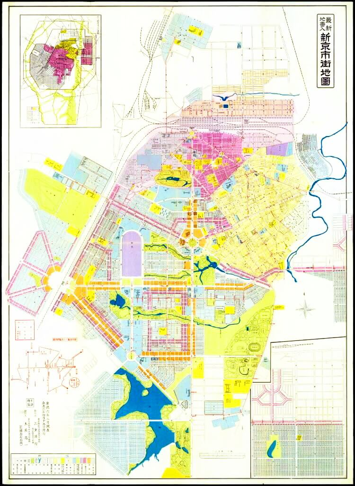

# 附录

## 区划沿革

!> **注** 被丁东村合并年份未确认，尚未找到可参考资料。

| 年代 | 区划 | 注释 |
|:------------:|:-----------|:-----------|
|1981|江苏省江都县丁沟公社黄铁大队龚庄生产队||
|1983|江苏省江都县丁沟乡黄铁村龚庄组|撤社建乡|
|1985|江苏省江都县丁沟镇黄铁村龚庄组|撤乡设镇|
|1994|江苏省江都市丁沟镇黄铁村龚庄组|撤县设市|
|2003|江苏省江都市丁沟镇黄铁村殷庄组|合并复兴村，被殷庄组合并|
|2005|江苏省江都市丁沟镇黄铁村殷庄组|合并麾村镇|
|2008|江苏省江都市丁沟镇丁东村殷庄组|被丁东村合并|
|2011|江苏省扬州市江都区丁沟镇丁东村殷庄组|撤市设区|

## 教师名录

### 黄铁小学（幼儿班-小学四年级）

!> **注** 朱老师名字待回忆

王兰芸 王海年 张生勇 朱？？ 吴志平 韩义和

### 丁沟中心小学（小学五六年级）
李琴 姚丽萍 朱礼忠  

### 丁沟中学（初中）

胡银华 禹良清 孙晓华 李鑫林 王艳 马根生 韩祖和 储德林 周源

### 丁沟中学（高中）

蒋晓琴 张文华 徐静 王江山 陈桂华 石明 陈平 马晓梅 蒋荣槐 袁李荣 葛国宏 张梅桂 朱少华 高圣广 于其泰 刘立忠

### 大学

何甲兴 李树根 董加礼 雷雨田 方沛辰 李松涛 毛宝安

## 吉林工业大学校园建设和历史建筑的沿革探源（修订版）

作者：南粤清风（袁幸）老工大子弟 国家一级注册建筑师
2019 年 9 月

[在线链接](http://www.weixinyunduan.com/weiweb/348175/bf3e0e561282dc76625f3ac9.html ':crossorgin')

> 在祖国母亲 70 周年华诞，在吉林工业大学建校 64 周年来临之际，谨以此文献给： 
> 每一位为学校的建设和繁荣添砖加瓦的校友； 
> 每一位曾经在这个校园工作、学习，并与之同呼吸共命运的人； 
> 每一位从小在这个校园里生活、长大，见证了它的历史变迁的人； 
> 因为吉林工业大学在我们每一位的心中永远长存！ 

> 前言：笔者曾在2015年9月写过《吉林工业大学校园建设和历史建筑的沿革探源》一文，原版有幸受到诸多工大校友们的关注。此次应吉林工大汽车系64、65届老校友出版《珍藏奋进》纪念回忆录编委的邀请，收入此文。借此机会对这篇文章进行修正和勘误，并充实了内容和图片，在标题后面加注了括号（修订版），以示区别。此文的目的是为吉林工业大学的校园建设与发展做一篇“史记”，留给后人，永誌怀念。因为我为吉林工大的校园发展和建设的漫长足迹而感慨，为每一代老工大人为校园建设的丰硕成果所付出的辛劳智慧而感动，这一切不能因为学校的更名而被抹去，而被遗忘。希望这一版能够展现出一个内容更加详实，图片更加清晰，情感更加真切的篇章，以答谢各位读者的热情支持。

吉林工业大学组建于1955年，原名长春汽车拖拉机学院，是由原交通大学（现分为西安交通大学和上海交通大学）、华中工学院（现为华中科技大学）和山东工学院（现为山东大学）的汽车、内燃机等有关专业为基础合并组建而成。她是新中国第一所培养汽车、拖拉机、农业机械人才的高等学府。当时隶属于国家第一机械工业部。1958 年11 月改名为吉林工业大学。是国务院首批批准授予博士学位、硕士学位和学士学位的高校之一。1997 年5 月，通过立项审核，成为国家“211工程”首批重点建设的27所院校之一。吉林工业大学是一所以汽车、农机为优势和特色，理、工、管、文相结合多科性大学。1998 年9 月，隶属于国家教育部直属高校。在以吉林工业大学命名的46年间，为国家的汽车工业、农业机械、机械工程及机电自动化等领域培养和造就了大批高层次人才，长江后浪推前浪，有目共睹，有据可查，功不可没，其建校历史源远流长。

学校园区占地面积为965亩，校园东西最长距离为1225米，南北最长距离为800米。校园中央大道西侧原校门旧址处，即中国科学院长春光学精密机械与物理研究所东围墙，距离人民大街255米。学校园区海拔高度为215.5米至223米，地形标高差为10米。校园区地势比较平坦，形成南高北低，由东南向西北顺次递降，地面坡度为9.5﹪。

2000年6 月，吉林工业大学与原吉林大学、白求恩医科大学、长春科技大学、长春邮电学院合并组建新的吉林大学。现在的校址叫吉林大学南岭校区（即：吉林大学工学学科、工学部、东区）。

吉林工业大学的校园建设历史可追溯到上世纪的1930、1940年代的日伪时期，长春在日本帝国主义侵略统治达14年之久，日寇于1936年成立伪满洲国，并选定中长铁路的中点长春，历史上叫“宽城子”的铁路附属地的地方扩城建设为国都，更名为“新京”，并进行了伪满洲国新京的详细规划，从“新京市街地图”（图1）上 寻找吉林工业大学的校园范围，以及东北光复以后1945年由前苏联绘制的“长春（新京）全图”英文地图上分析，现在的吉林工业大学校园，上世纪30、40年代时分为南北两个片区，以老校部楼（红楼）至西大门（吉林工业大学正校门）的校园东西向主路中央大道为分界线，北区是日伪时期规划的院校区，当时建成的有中央警察学校（一校区）；合同学校—司法部法学校（二校区）；司法部法学校、中央师道训练所（三校区）；伪满新京财务职员养成所，即伪满新京财务职员训练班（四校区）；合同学校（五校区）；大同学院（老校部红楼）；新京工业大学附属工科学校（原吉林工业大学附属小学平房校舍）。

图1 新京市街地图

